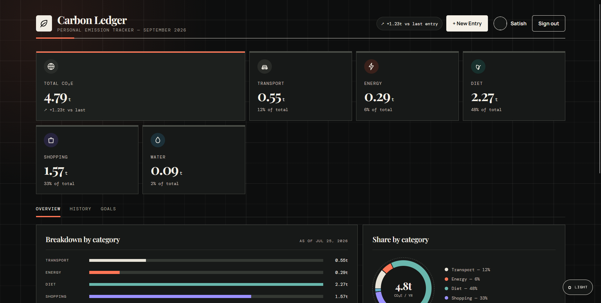
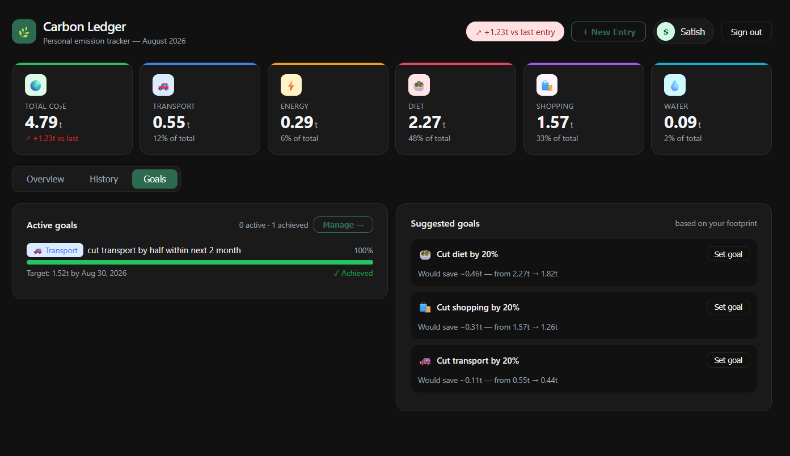
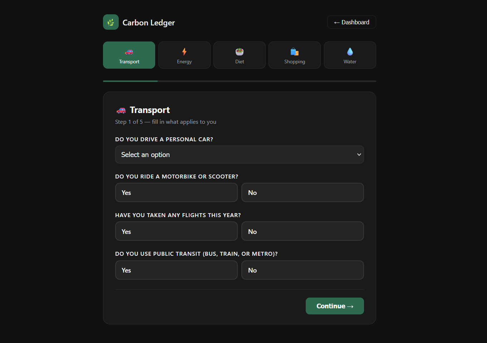
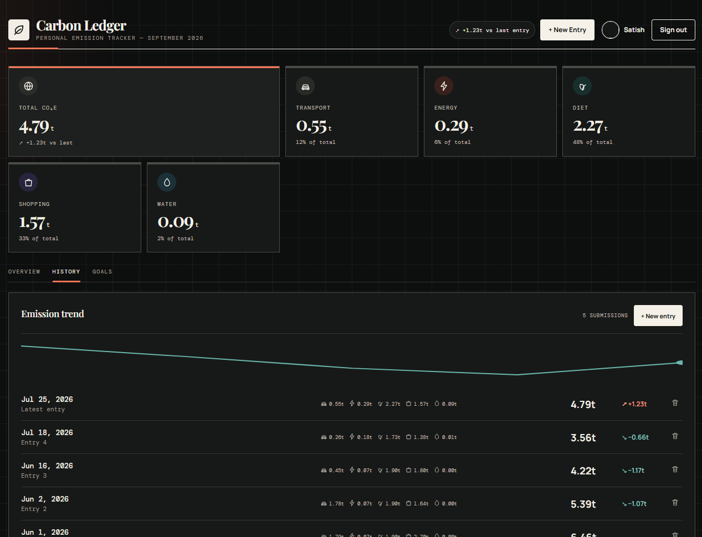

# 🌍 Carbon Ledger


A full-stack web application to track, monitor, and reduce your personal carbon footprint.


## About


Carbon Ledger helps users understand and reduce their environmental impact by tracking emissions from daily activities — transport, energy, diet, and shopping. Users can visualize trends over time, set reduction goals, and compare their footprint against global averages.


## Features


- 👤 **User Authentication** — Secure register/login with JWT cookies and bcrypt password hashing

- 🔑 **Google Sign-In** — One-tap Google OAuth login alongside email/password

- 🖼️ **Profile Pictures** — Upload and display a custom avatar (Multer, local disk storage)

- 🧮 **Carbon Calculator** — Multi-step calculator covering transport, energy, diet, and shopping

- 📊 **Dashboard** — Visual breakdown of emission trends over time

- 🎯 **Goals** — Set and track personal carbon reduction goals

- 🗂️ **Profile** — Manage location, household, and lifestyle preferences

- 🔐 **Admin Panel** — Admin-only route to view all users (role-based access control)

- 🌱 **Seed Data** — Pre-built seed script with realistic user profiles for testing


## Screenshots


| Dashboard | Goals |

|---|---|

|  |  |


| Calculator | History |

|---|---|

|  |  |


## Tech Stack


- **Frontend** — Next.js (TypeScript)

- **Backend** — Node.js, Express.js

- **Database** — MongoDB, Mongoose

- **Auth** — JWT, bcrypt, httpOnly cookies, Google OAuth (google-auth-library)

- **File Uploads** — Multer (avatar images, saved to local disk)

- **Hosting** — Render (backend), Vercel (frontend), MongoDB Atlas (database)


## Project Structure


```

carbon/

├── client/                  # Next.js frontend

│   └── app/

│       ├── calculator/      # Carbon footprint calculator

│       ├── components/      # Shared components (e.g. GoogleButton)

│       ├── dashboard/       # Main dashboard

│       │   ├── goals/       # Goals tracking

│       │   └── profile/     # User profile, avatar upload

│       ├── login/

│       └── register/

└── server/                  # Express backend

    ├── constants/           # Emission factors

    ├── controller/          # Auth controller (password + Google)

    ├── db/                  # MongoDB connection

    ├── middleware/          # JWT auth, admin guard, Multer upload config

    ├── models/              # Mongoose models

    ├── routes/              # API routes

    ├── uploads/avatars/     # Uploaded profile pictures (gitignored)

    ├── Seed.js              # Database seeder

    └── admin.js             # Admin role utility

```


## Getting Started


### Prerequisites


- Node.js

- npm

- MongoDB (running locally on port 27017)


### Installation


1. Clone the repository

   ```bash

   git clone https://github.com/Satish0802/carbon-ledger.git

   cd carbon-ledger

   ```


2. Install server dependencies

   ```bash

   cd server

   npm install

   ```


3. Install client dependencies

   ```bash

   cd ../client

   npm install

   ```


4. Set up environment variables — create `server/.env`:

   ```

   PORT=8000

   MONGO_URI=mongodb://localhost:27017/carbon_ledger

   JWT_SECRET=your_jwt_secret

   CLIENT_URL=http://localhost:3000

   NODE_ENV=development

   GOOGLE_CLIENT_ID=your_google_oauth_client_id

   ```


5. Create `client/.env.local`:

   ```

   NEXT_PUBLIC_API_URL=http://localhost:8000

   NEXT_PUBLIC_GOOGLE_CLIENT_ID=your_google_oauth_client_id

   ```

   Get a Google OAuth client ID from the [Google Cloud Console](https://console.cloud.google.com/apis/credentials) — add `http://localhost:3000` under Authorized JavaScript origins for local dev.


### Running the App


**Start MongoDB** (if not running as a service):

```bash

mongod

```


**Start the server:**

```bash

cd server

npm run dev

```


**Start the client:**

```bash

cd client

npm run dev

```


Open [http://localhost:3000](http://localhost:3000) in your browser.


## Seed Data


To populate the database with test users and emission entries:


```bash

cd server

node Seed.js

```


This creates 3 users with 6 months of realistic emission data each:


| Email | Password | Profile |

|-------|----------|---------|

| priya@carbonledger.dev | password123 | Vegetarian, improving (India) |

| marcus@carbonledger.dev | password123 | High emitter, slowly reducing (US) |

| sofia@carbonledger.dev | password123 | Vegan, already low (Netherlands) |


## Admin Access


To grant admin privileges to an account:


1. Register a user normally on the app

2. Edit `server/admin.js` and set the email to your account's email

3. Run:

   ```bash

   cd server

   node admin.js

   ```

4. Sign out and log back in — the new JWT will include the admin role


Admin accounts can access `GET /users/all` to view all registered users.


## API Routes


| Method | Route | Auth | Description |

|--------|-------|------|-------------|

| POST | /users/register | Public | Register a new user |

| POST | /users/login | Public | Login |

| POST | /users/logout | User | Logout |

| PUT | /users/:id | User | Update own account |

| DELETE | /users/:id | User | Delete own account |

| GET | /users/all | Admin | Get all users |

| GET | /users/profile | User | Get own user record |

| POST | /emissions | User | Submit new calculator entry |

| GET | /emissions/:userId/latest | User | Get latest emission entry |

| GET | /emissions/:userId | User | Get all entries for user |

| DELETE | /emissions/:id | User | Delete an emission entry |

| POST | /users/google | Public | Login/register via Google OAuth |

| GET | /profile/:uid | User | Get user profile |

| PUT | /profile/:uid | User | Update user profile |

| POST | /profile/:uid/avatar | User | Upload/replace profile picture (multipart form, field name `avatar`) |

| POST | /goals | User | Create a new goal |

| GET | /goals/:userId | User | Get all goals for user (active + achieved) |

| PATCH | /goals/:id/progress | User | Update a goal's progress |

| DELETE | /goals/:id | User | Cancel/delete a goal |


## Deployment


This app is deployed as three separate pieces:


- **Backend** → [Render](https://render.com) (Web Service, root directory `server`, start command `node index.js`)

- **Frontend** → [Vercel](https://vercel.com) (root directory `client`)

- **Database** → [MongoDB Atlas](https://www.mongodb.com/atlas)


### Backend (Render)


Set these under your Render service's **Environment** tab:


```

PORT=8000

MONGO_URI=<your Atlas connection string>

JWT_SECRET=<your secret>

CLIENT_URL=<your production Vercel URL>

NODE_ENV=production

GOOGLE_CLIENT_ID=<your Google OAuth client ID>

```


In `server/index.js`, make sure the CORS whitelist includes your exact production Vercel URL.


> ⚠️ **Avatar uploads use local disk storage.** Render's filesystem is ephemeral on standard/free plans — uploaded profile pictures will be lost on redeploy or restart. This is a known limitation; migrating to Cloudinary/S3 is a future improvement if persistent avatars become important.


### Frontend (Vercel)


Set these under Project → Settings → Environment Variables (scoped to Production):


```

NEXT_PUBLIC_API_URL=<your Render backend URL>

NEXT_PUBLIC_GOOGLE_CLIENT_ID=<your Google OAuth client ID>

```


These are build-time variables — redeploy after adding or changing them.


### MongoDB Atlas


Under Network Access, allow inbound traffic from Render (`0.0.0.0/0` is simplest unless using a static outbound IP).


### Google OAuth


In [Google Cloud Console](https://console.cloud.google.com/apis/credentials) → your OAuth client → **Authorized JavaScript origins**, add your production Vercel URL. Without this, the Google Sign-In button won't render in production.


## License


[MIT](LICENSE):